<!-- Header -->

  <h1>Hi, I'm Anete 👋</h1>
  
AI and ML Developer • Developer-focused educator • Technical content creator

  
  
  

---

## About me
I’m an **AI & Computer Science graduate** with 5+ years of experience creating technical education for developers and beginners alike.  
I’ve worked with companies (startups mostly) like **Sololearn**, **Code First Girls**, **Multiverse**, and **Flip Computing** ([check out Flock XR!](https://flockxr.com/)), where I designed and delivered courses on topics ranging from **Web Dev**, **Java**, and **data science** to **Machine Lerning** and **Generative AI**.  

Currently freelancing and open to **global opportunities** in:    
- AI, ML & Data Science  
- Project/Program Management
- Developer Advocacy  
- Tech Education & Technical Writing

---

## A bit more about me
- Learning more about embedded ML ([check out my bee project](https://github.com/AneteZepa/HappyBees))
- Regular at the gym (weights > cardio)
- I enjoy both tea & coffee, especially with a sweet treat
- I love summer and snow, not so much the autumn chill and darkness
- Love to do DIY from painting to renovating kitchens, making things with my hands, not just digitally
- Still writing articles or talking about things that matter

---

## A non-exhaustive list of skills
`Python` · `JS` · `SQL` 
`AI and ML` · `RAG` · `Prompt Engineering` 
`Instructional Design` · `Tech Writing` · `Project Management`  

---

## GitHub stats

Admittedly, I have been quiet here on GitHub for the last year or so - but I am bringing it back to life! 
<a href="https://github.com/AneteZepa">
<table align="center">
  <tr>
    <td align="center" style="padding: 5px;">
      
    </td>
    <td align="center" style="padding: 5px;">
      
    </td>
  </tr>
</table>

---

  
 A bit more personal

   
  • Based in Riga, Latvia, open to global roles   
  • Supporter of AI (great for putting a lot on the paper quickly, but definitely needs editing) — but mindful of flaws, overuse & IP concerns   
  • Built & ran hackathons back in uni, created women coding communities at CFG, and still love community building   
  • Happy to have a chat about most topics - feel free to reach out either on LinkedIn or email! 

<!--
**AneteZepa/AneteZepa** is a ✨ _special_ ✨ repository because its `README.md` (this file) appears on your GitHub profile.

Here are some ideas to get you started:

- 🔭 I’m currently working on ...
- 🌱 I’m currently learning ...
- 👯 I’m looking to collaborate on ...
- 🤔 I’m looking for help with ...
- 💬 Ask me about ...
- 📫 How to reach me: ...
- 😄 Pronouns: ...
- ⚡ Fun fact: ...
-->
