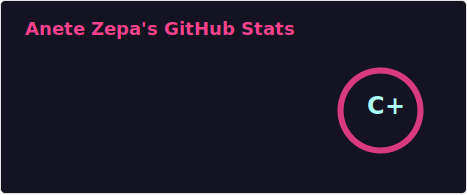
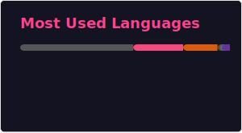

<!-- Header -->

  <h1>The intro to Anete</h1>
  
AI and ML Developer • Developer-focused educator • Technical content creator

  
  
  

---

## About me
I’m an AI & Computer Science graduate with 5+ years of experience in TechEd. I currently work as **an AI Engineer** - building real systems that are not just LLM wrappers. 

In my past life I worked with TechEd startups like **Sololearn**, **Code First Girls**, **Multiverse**, and **Flip Computing** ([check out Flock XR!](https://flockxr.com/)), where I created and delivered beginner to mid career and leadership aimed accelerator courses on topics ranging from **Web Dev**, **Python**, and **data science** to **Machine Lerning**, **Generative AI**, and **Leadership**. 

---

## A bit more about me
- Capable outside the digital world in everythinggg
- Europe
- High standards, but lazy

---

## A non-exhaustive list of skills
`Python` · `JS` · `SQL` · `vibecoding - but I know what's up`  ·
`AI and ML` · `RAG` · `Prompt Engineering` · `ADK` · `Agents` · `GCP`  ·
`Instructional Design` · `Tech Writing` · `Project Management` 

---

## GitHub stats

Admittedly, I have been quiet here on GitHub for the last year or so - but I am bringing it back to life! 
<a href="https://github.com/AneteZepa">
<table align="center">
  <tr>
    <td align="center" style="padding: 5px;">
      
    </td>
    <td align="center" style="padding: 5px;">
      
    </td>
  </tr>
</table>

---

  
 A bit more personal

   
  • Latvia and cats  
  • Supporter of AI as I am lazy (Claude Code, but use it as a tool, not to outsource your brain - try to have an original thought or take once in a while, ok?), but mindful of limitations, overuse effects & IP theft   
  • Built & ran hackathons back in Uni, created women coding communities at CFG and more, and for sure could make a better event than most I have been at  
  • Open to new friends  
  • A bit loud, direct and not bending to 'authority'  

